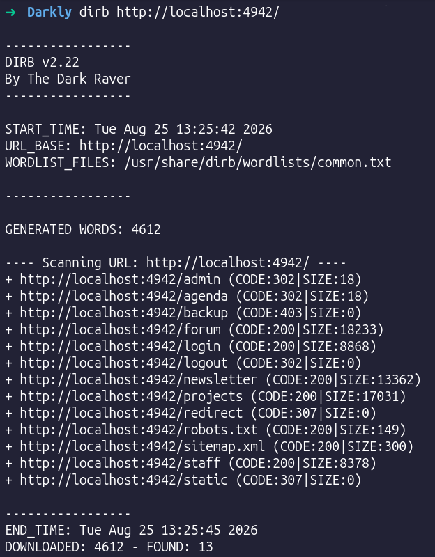
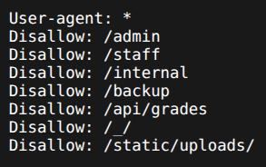
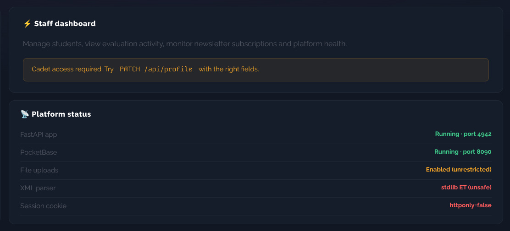
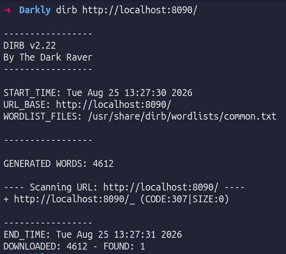

## Chapter 1 — Information Disclosure 
#recon #information-disclosure

It’s a good approach to know what to attack before attacking, so I ran #dirb on http://localhost:4942 \\

- /robots.txt : \\

- /staff \\

/staff page gives good hints: 

- "File uploads: unrestricted" → #unrestricted-upload
- "XML parser: stdlib ET (unsafe)" → #xxe
- "Session cookie: httponly=false" → #httponly (cookie theft later)
- "Try PATCH /api/profile" → #mass-assignment
- PocketBase on :8090 confirmed → #pocketbase

I ran #dirb on http://localhost:8090/ \\

here is the thing: as a Guest I visited http://localhost:4942/forum, and I checked all profiles and here is the information that I got:

| Username    | Email                       | Role    | ID              |
| ----------- | --------------------------- | ------- | --------------- |
| jdoe        | jdoe@student.42.tech        | student | z4p1cnx47mfy50f |
| benjamin    | benjamin@student.42.tech    | student | 8l16vboi47dmand |
| dorian      | dorian@student.42.tech      | student | 02g7nfbtw0k83fu |
| thanos      | thanos@student.42.tech      | student | sf6wtjycbyev4ah |
| anne-sophie | anne-sophie@student.42.tech | student | 0e9p852l6utwaal |
| moderator   | moderator@42network.fr      | student | xxv1btvtzaxen5h |
| emilie      | emilie@42.tech              | cadet   | 2na6hw2z9p1yosj |
| wil         | wil@42network.fr            | staff   | k1asdfeditojrb4 |
| sophie      | sophie@42.tech              | god     | enplwhu8jfo56oi |

notes:
- showing the IDs of users and their email is really bad!
- @jdoe said that his password is easy to guess, so I am thinking 🤔 of brute-forcing it!
- @benjamin said that the token is literally the md5 of his email address. This is good info — we can break authentication now with it!
- @wil said: "Network ops ref for the team: dmFsaWRhdGlvbl9rZXk9NDJuZXR3b3Jr". After I decoded this using a base64 decoder I got `validation_key=42network`. Ohhh bro, they are cooked!! We can use it to break #JWT

### Impact
Public pages expose emails, roles, internal IDs, and secrets planted in profiles and posts (the base64 key, the password and reset hints). These leaks directly enable the next attacks: brute-forcing @jdoe, breaking authentication via the md5 reset token, and forging JWTs with the leaked secret. Information disclosure becomes the entry point for the whole chain.

### Prevention
- Don't expose internal IDs and emails publicly; return only what the viewer is allowed to see.
- Never store secrets (keys, hints) in user-visible fields, and never post them in the forum.
- Strip sensitive data from public pages, error messages, and API responses.

