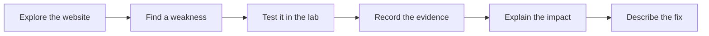
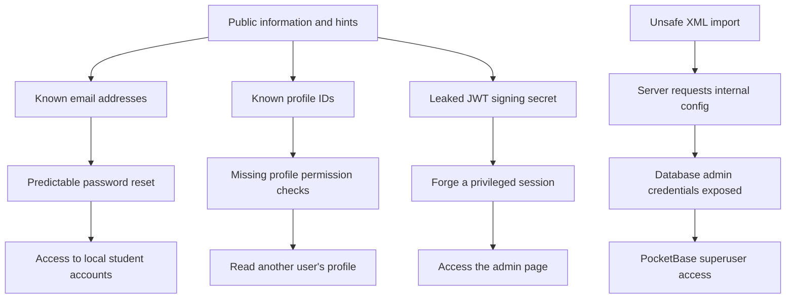
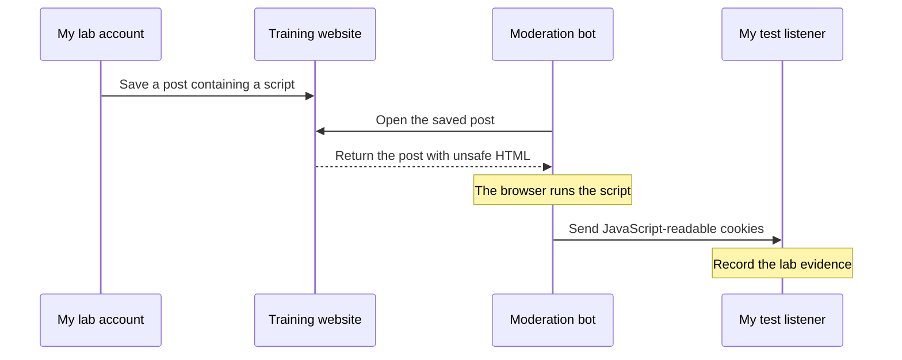

# 1337 · Darkly · 42

### Learning web security by finding, understanding, and explaining weaknesses

**13 security chapters · 11 Bash scripts · 9 saved flags**

## About this project

This repository is my web security learning journal for Darkly. I explored a vulnerable training website, tested its security, and wrote down what I found.

My goal was to understand how a small mistake can expose private data, give someone access to another account, or lead to control of the database. For each finding, I explain the problem, its impact, and ways to prevent it.

This repository contains my reports, demonstration scripts, screenshots, and flags. The training application and its setup files are not included. A **flag** is a special text value used by the lab to show that a challenge was solved.

## Why this project matters

Web applications handle passwords, personal information, and private records. If they trust the wrong input or forget a permission check, that information can become exposed.

This project helped me understand that security is part of everyday development:

- A password reset must prove that the person owns the account.
- Being logged in does not mean someone can read every profile.
- Uploaded files and forum posts can contain unsafe content.
- A leaked secret can affect much more than one page.
- Internal services still need strong protection.

The biggest lesson is that **small weaknesses can connect into a much larger problem**.

## What I did

1. **Explored the website.** I used a browser and `dirb` to discover pages and services. I checked `robots.txt`, public profiles, forum posts, and response headers for useful clues.
2. **Tested access rules.** I checked whether a normal account could read another user's profile, list users, or change its own role.
3. **Tested accounts and sessions.** I investigated predictable password reset tokens, cookies, and JWTs—the signed tokens used for sessions.
4. **Tested user input.** I examined avatar uploads, forum posts, XML imports, download paths, and redirect URLs.
5. **Connected the findings.** I used information from earlier steps to understand later problems, including access to the PocketBase database service.
6. **Documented the results.** I wrote 13 explanations with impacts and prevention advice, created 11 Bash scripts, and saved 9 flag files.



## What I found

Each topic below links to its full explanation.

| # | Topic | What I demonstrated | Main lesson |
|---|---|---|---|
| 01 | [Information disclosure](01_information-disclosure/explanation.md) | Public pages revealed account details, internal paths, and secret hints. | Share only the information a visitor needs. |
| 02 | [Insecure password reset](02_Insecure-password-reset/explanation.md) | Reset tokens could be calculated from public email addresses. | Use random, short-lived, single-use reset tokens. |
| 03 | [Broken access control / IDOR](03_broken-access-control-idor/explanation.md) | A student session could open a staff profile by its ID. | Check permission for every requested record. |
| 04 | [Unrestricted file upload](04_Unrestricted-File-Upload/explanation.md) | The avatar feature accepted an SVG image containing a script. | Validate uploads and serve them safely. |
| 05 | [Stored XSS](05_Stored-XSS/explanation.md) | A saved forum script ran in the moderation bot's browser and exposed cookies. | Render user content safely and protect session cookies. |
| 06 | [Mass assignment](06_Mass-Assignment-Privilege-Escalation/explanation.md) | A profile update changed my role from student to cadet. | Allow users to edit only approved fields. |
| 07 | [JWT forgery](07_JWT-Forgery-Weak-Signing-Secret/explanation.md) | A leaked signing secret let me create a token for a privileged account. | Keep signing keys strong and private. |
| 08 | [XXE / server-side request forgery](08_Server-Side-Request-Forgery/explanation.md) | The XML import test made the server request an internal configuration page. | Restrict XML features and access to internal services. |
| 09 | [PocketBase superuser access](09_PocketBase-Superuser-Access/explanation.md) | Leaked administrator credentials allowed access to protected database data. | Protect database credentials and administrator access. |
| 10 | [Path traversal](10_LFI-Path-Traversal/explanation.md) | A download request reached a private file outside the intended folder. | Keep resolved file paths inside an allowed directory. |
| 11 | [Open redirect](11_Open-Redirect/explanation.md) | A website link could redirect visitors to an unchecked external site. | Validate redirect destinations. |
| 12 | [User enumeration](12_User-Enumeration/explanation.md) | A normal account could list users, emails, roles, and IDs. | Limit which account details each user can see. |
| 13 | [Security misconfiguration](13_Security-Misconfiguration/explanation.md) | Debug hints, cookie settings, and exposed services helped other attacks. | Use safe settings and remove unnecessary exposure. |

**Useful terms:** IDOR means accessing someone else's record through its identifier without a proper permission check. XSS means running attacker-controlled JavaScript in a visitor's browser. XXE involves unsafe handling of external entities in XML. SSRF means making the server send a request chosen by an attacker.

## How the findings connect

These are some of the paths described in my reports. They are separate branches, rather than one required sequence.



For example, an email address is not a password. But when a reset token depends only on that address, public information becomes enough to reset an account. The deeper problem is the reset design.

## A closer look: stored XSS

This test showed me why the exact page and browser matter. The forum list and the individual post page handled content differently. The moderation bot opened the individual post, where the saved script ran.



Setting `HttpOnly` prevents JavaScript from reading a session cookie, but it does not fix XSS itself. The application must also escape text or safely sanitize allowed HTML before showing it.

## Tools I used

| Tool | How I used it |
|---|---|
| Browser | Explore pages, profiles, forms, and source content. |
| `dirb` | Discover web paths during the first investigation. |
| Bash and `curl` | Send HTTP requests and repeat the lab demonstrations. |
| OpenSSL | Create an HMAC signature for the JWT demonstration. |
| Python 3 | Run a local HTTP listener for upload and XSS tests. |
| `jq` | Make JSON responses easier to read. |
| Linux command-line tools | Process responses, calculate hashes, and extract flags. |

## Finding your way around

The folders are numbered from `01` to `13`, following the investigation topics.

```text
1337-Darkly-42/
├── Readme.md
├── 01_information-disclosure/
│   ├── explanation.md       # Discovery notes and lessons
│   └── Resources/           # Screenshots
├── 02_Insecure-password-reset/
│   ├── explanation.md       # Problem, impact, and prevention
│   ├── exploit.sh           # Lab demonstration
│   └── flag                 # Saved challenge result
├── ...                      # Chapters 03 to 12
└── 13_Security-Misconfiguration/
    └── explanation.md
```

Every chapter has an `explanation.md`. Chapters **02–12** also have an `exploit.sh`, and chapters **02–10** have a saved `flag`. Chapter 04 includes an SVG test file in `Resources/`.

## Reading or repeating the lab

Start with [Chapter 01](01_information-disclosure/explanation.md), then follow the numbered reports. You can read everything without running the application.

To repeat a demonstration, you need the separate training environment. The scripts expect the website at `http://localhost:4942` and PocketBase at `http://localhost:8090`. They use fixed lab accounts, IDs, and credentials, so read each script and check its assumptions first. Run them only in your own lab or an environment you have permission to test; some change passwords, roles, or saved content.

Run a script from its own chapter folder so that relative file paths work:

```bash
cd 11_Open-Redirect
bash exploit.sh
```

For upload and XSS demonstrations, port `8000` must be available. The moderation bot must also be able to reach the listener address.

### Notes about reproducibility

- Many scripts expect the `jdoe` lab password to already be `abc123`.
- Chapter 02's script targets `benjamin`, while its report records finding the flag in `dorian`'s account.
- Chapter 09's script uses `/api/admins/auth-with-password` and the `internal_audit` collection. Its report describes `/api/collections/_superusers/auth-with-password` and `internal_config`. Check which endpoints and collections exist in your lab.
- These are learning scripts, not an automated test suite. A success message alone is not proof; check the actual response or flag.

## What I learned

I learned how to read HTTP requests and responses, work with cookies and tokens, test permission boundaries, and turn manual findings into repeatable scripts.

I also learned to separate **logging in** from **being allowed to do something**. A valid session should never give unrestricted access to another person's data. Hard-to-guess IDs can help reduce guessing, but they do not replace permission checks.

Most of all, I learned to explain both sides of a security finding: **how it works and how to prevent it**. Finding a flag is useful practice; understanding the mistake helps me build safer applications.
